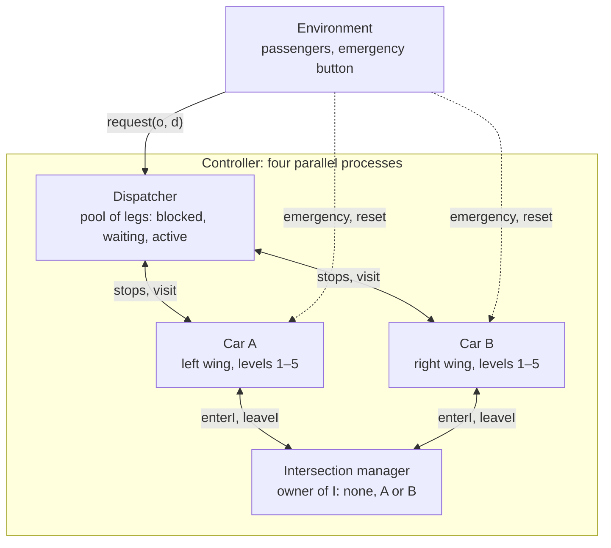

# Touchpoint Towers (mCRL2 Project)

Oct 6, 2026 · @teo

## 1. System description

Two elevators, each confined to its own wing, share exactly one floor: the Touchpoint I. It is both a crossing both cars pass through and the only place to change cars.

**Story:** An architect designs two towers after Michelangelo's *Creation of Adam*: two figures reaching for each other. The wings lean together and meet at a single floor halfway up. Unlike in the painting, the fingers do touch, and two elevator rails now pass through the same point.

- Car A serves levels 1–5 of the left wing; car B serves levels 1–5 of the right wing.
- Level 3 is Touchpoint I, shared by both. Cars pass through it to get between low and high levels.
- A trip between wings is split into two legs: origin → I with one car, then I → destination with the other.
- Passengers use destination dispatch: they enter the destination at a terminal; the origin is implicit.

**Modelling goals.** Show that both cars obey the rules of the intersection, never move with open doors, serve every request, and hand transfer passengers over correctly, for every order in which requests arrive. Schedule optimality is out of scope.

**Abstractions / Assumptions:**

- Discrete levels; no time. A car jumps directly to its next stop in one atomic move.
- Requests are (origin, destination) pairs; identical pairs merge.
- The pending pool is bounded by a constant (5 legs); car and floor capacity are unbounded.
- The number of levels is constant.

**Challenge:**

- **Forced cooperation:** neither car reaches the other wing, so cross-wing trips need both.
- **Shared resource:** I is a mutex, held briefly when passing and longer when stopping.
- **Handoff:** leg 2 may only start after leg 1 has dropped its passenger at I.
- **Bookkeeping vs. scheduling:** one stop can activate and complete several requests at once, while each car chooses its own visiting order.
- **Expected failure modes:** a car idling at I starves the other; deadlocks around I once transfer capacity is bounded.

## 2. Components

The cars never talk to each other directly: all coordination runs through the dispatcher (work) and the intersection manager (I). Communication between the dispatcher and the intersection manager might become necessary.

| Component | State | Responsibility |
| --- | --- | --- |
| Dispatcher | Pool of legs (o, d, state), state ∈ {blocked, waiting, active} | Tells each car its stop set. On a visit: waiting legs with that origin → active; active legs with that destination → completed; completing leg 1 unblocks leg 2. |
| Car A, Car B (one process, parameter e) | Level, direction, doors | Reads its stop set, picks the next level (LOOK schedule), moves multiple levels at a time, opens and closes doors, reports visits. Acquires the I mutex before entering level 3; releases it after leaving. |
| Intersection manager | Owner of I ∈ {none, A, B} | Grants the I mutex to at most one car; frees it on release. |
| Environment | — | Issues requests; presses emergency and reset. |

Stop set of car e = origins of its waiting legs ∪ destinations of its active legs. Blocked legs contribute nothing, so no car visits I for a passenger who has not arrived yet.

## 3. Actions

Locations are `Loc = struct I | fl(w: Car, n: Nat)` with n ∈ {1, 2, 4, 5}; a car's position is a level 1–5, where 3 is I.

| Action | Parameters | Between | Meaning |
| --- | --- | --- | --- |
| `request(o, d)` | o, d: Loc, o ≠ d | Env → Dispatcher | A passenger at o asks to travel to d. |
| `stops(e, S)` | e: Car, S: FSet(Nat) | Dispatcher ↔ Car e | Car e reads the levels it must visit. |
| `move(e, f1, f2)` | e: Car, f1, f2: Nat | Car e | Car e moves from level f1 to level f2. |
| `enterI(e)` | e: Car | Car e ↔ Intersection mgr | Car e is granted I; precedes crossing or entering moves. |
| `leaveI(e)` | e: Car | Car e ↔ Intersection mgr | Car e has moved off or through level 3 and releases I. |
| `open(e)`, `close(e)` | e: Car | Car e | Doors of car e open / close. |
| `visit(e, n)` | e: Car, n: Nat | Car e ↔ Dispatcher | Car e serves level n with doors open; the dispatcher updates the pool. |
| `pickup(e, o, d)` | e: Car, o, d: Loc | Dispatcher | Leg (o, d) becomes active: its passenger boards car e. |
| `dropoff(e, o, d)` | e: Car, o, d: Loc | Dispatcher | Leg (o, d) completes: its passenger leaves car e. |
| `done(o, d)` | o, d: Loc | Dispatcher | The original request (o, d) is complete (after its last leg). |
| `emergency`, `reset` | — | Env ↔ Car A ↔ Car B | Emergency stop starts / ends; both cars receive it at once. |

## 4. Requirements

### Safety

| ID | Requirement | In terms of actions |
| --- | --- | --- |
| S1 | At most one car is in I. | Between `enterI(e)` and `leaveI(e)`, no `enterI(e')` with e' ≠ e. |
| S2 | No car passes through or stops at I without permission. | A `move(e, f1, f2)` with min(f1, f2) ≤ 3 ≤ max(f1, f2) only occurs after `enterI(e)` with no `leaveI(e)` in between. |
| S3 | A car never moves with open doors. | After `open(e)`, no `move(e, _, _)` before `close(e)`. |
| S4 | Service only happens with open doors. | `visit(e, n)` only occurs between `open(e)` and `close(e)`. |
| S5 | A car only serves levels where it has work. | After `stops(e, S)`, no `visit(e, n)` with n ∉ S before the next `stops(e, _)`. |
| S6 | Transfer passengers are handed over in order. | For a cross-wing request, `pickup(e₂, I, d)` never occurs before `dropoff(e₁, o, I)`. |
| S7 | No phantom completions. | `done(o, d)` only occurs after `request(o, d)` with no `done(o, d)` in between. |
| S8 | Emergency stops both cars. | After `emergency`, no `move(e, _, _)` before `reset`. |
| S9 | A car never skips work. | After `stops(e, S)`, no `move(e, f1, f2)` has a level of S strictly between f1 and f2, before the next `stops(e, _)`. |
| S10 | Doors only open at a level where the car has work. | `open(e)` only occurs when the level the car last moved to (f2 of its last `move(e, f1, f2)`) is in its last stop set S. |

### Liveness

| ID | Requirement | In terms of actions |
| --- | --- | --- |
| L1 | No deadlock. | `[true*]<true>true` |
| L2 | Every request is served. | After `request(o, d)`, `done(o, d)` inevitably follows on every path without further `request`, `emergency` or `reset`. |
| L3 | A request always remains servable. | After `request(o, d)`, `done(o, d)` stays reachable until it occurs. |
| L4 | No car parks at I. | After `enterI(e)`, `leaveI(e)` inevitably follows, under the same assumption as L2. |

### Scheduling (TBD)

| ID | Requirement | In terms of actions |
| --- | --- | --- |
| P1 | LOOK: a car never reverses while work lies ahead. | A move is up if f2 > f1, else down. After `stops(e, S)`, a move against the previous direction only occurs when S has no level ahead in that direction. |
